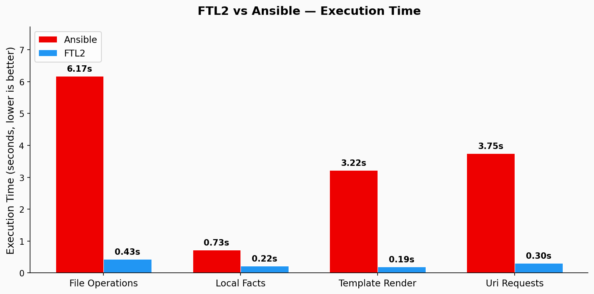
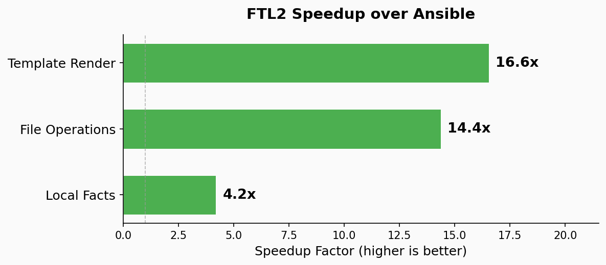
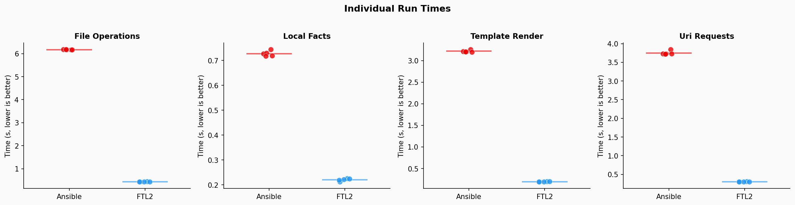

# ftl2-performance

Side-by-side performance benchmarks comparing FTL2 and Ansible.

## Setup

Ansible and FTL2 require separate virtual environments because FTL2 modifies the Ansible package at import time.

```bash
python3 run_benchmark.py --setup
```

This creates `.venv-ansible/` (clean ansible-core) and `.venv-ftl2/` (ftl2 editable install from `~/git/faster-than-light2`).

## Usage

```bash
# Run all benchmarks (3 runs each)
python3 run_benchmark.py

# Run a specific benchmark
python3 run_benchmark.py file_operations

# Custom run count
python3 run_benchmark.py --runs 5

# List available benchmarks
python3 run_benchmark.py --list

# Save results to JSON
python3 run_benchmark.py --json results.json
```

## Adding a benchmark

Create a directory under `benchmarks/` with three files:

```
benchmarks/my_benchmark/
    bench.py          # metadata (DESCRIPTION string)
    playbook.yml      # Ansible playbook
    ftl2_script.py    # FTL2 equivalent script
```

`bench.py` just needs a `DESCRIPTION` string:

```python
"""What this benchmark measures."""
DESCRIPTION = "Short description for the summary table"
```

The runner times each side independently using its own venv's Python interpreter.

## Results







Speedup scales with task count. Single-module overhead is ~4x (startup cost), but multi-task benchmarks show 14-17x because FTL2 avoids Ansible's per-task subprocess fork.

### Generating charts

```bash
# Run benchmarks and save results
python3 run_benchmark.py --runs 5 --json results.json

# Generate charts (requires matplotlib in .venv-ftl2)
.venv-ftl2/bin/python generate_charts.py
```

Charts are written to `charts/`.
